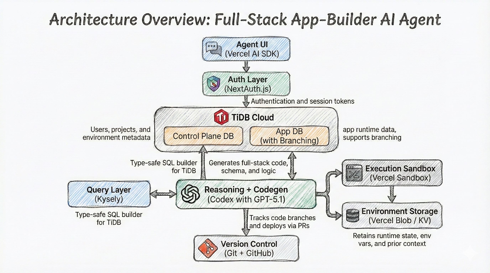

<p align="center">
  
</p>

# How to Build an AI Agent that Builds Full-Stack Apps
An open-source starter kit using TiDB Cloud, Vercel, Kysely, and GitHub. Think of this as a minimal, self-hostable cousin of [Lovable.dev](https://lovable.dev/) that you fully own and control.

> Describe an app and this agent provisions GitHub + TiDB Cloud + Vercel, codes with [Codex (gpt-5.1-codex)](https://openai.com/codex/) and [Claude Code (claude-sonnet-4.5)](https://www.claude.com/product/claude-code), tests, deploys, and streams the whole session. The code is public at https://github.com/pingcap/full-stack-app-builder-ai-agent.

## What This Agent Can Do
- Generate complete web apps from a prompt (Next.js 16 + shadcn/Tailwind).
- Provision TiDB Cloud clusters/branches per project and per instruction.
- Track versions so code, schema, and credentials stay aligned.
- Run and preview apps instantly via Vercel sandboxes and previews.
- Keep conversational context between generations for iterative refinement.
- Scale down idle environments with TiDB Cloud serverless.

## Architecture Overview

<p align="center">
  
</p>

- **Server actions** (`src/actions/*`) orchestrate GitHub, TiDB Cloud, and Vercel resources.
- **Sandboxes** (`src/sandboxes/*`) launch per-task runtimes, run `npm run dev`, and report via `src/app/hooks/v1/sandboxes/[sandboxId]/route.ts`.
- **Session UI** (`src/app/(customer)/s/[slug]`) streams logs, checkpoints, and deploy links.
- **Auth & protection** (`src/proxy.ts`, `src/lib/auth*`) gate `/projects`, `/settings`, and API v1 routes.

## How It Works (End-to-End)
1. **Prompt** – “Build a todo app.”  
2. **Plan** – Model drafts an execution plan.  
3. **Provision** – Create TiDB cluster/branch, Vercel sandbox, GitHub repo/branch, and env vars.  
4. **Generate** – Codex/Claude Code writes app code, Kysely schema, and migrations.  
5. **Migrate** – Run typed migrations against the TiDB branch.  
6. **Deploy** – Commit to GitHub and trigger a Vercel preview.  
7. **Iterate** – Follow-up prompts (e.g., “Add a username field”) spawn new TiDB branches and code revisions, keeping everything reversible.

## Magic Features
- **Checkpointed versions** – Git branches map to TiDB branches for perfect code–data sync.
- **Type-safe migrations** – Kysely migrations keep schema evolution safe and reversible.
- **Scale-to-zero** – TiDB Cloud serverless + Vercel sandboxes support many isolated environments without idle cost.

```ts
// TiDB Cloud branch creation (simplified)
import fetch from "node-fetch";

async function createBranch(clusterId, displayName, publicKey, privateKey) {
  const res = await fetch(
    `https://serverless.tidbapi.com/v1beta1/clusters/${clusterId}/branches`,
    {
      method: "POST",
      headers: {
        "Content-Type": "application/json",
        Authorization:
          "Basic " + Buffer.from(`${publicKey}:${privateKey}`).toString("base64"),
      },
      body: JSON.stringify({ displayName }),
    },
  );
  if (!res.ok) throw new Error(await res.text());
  return (await res.json()).branchId;
}
```

## Directory Layout
| Path | Purpose |
| --- | --- |
| `src/app/(auth)` | Credential login flow rendered via `LoginForm`. |
| `src/app/(main)` | Internal dashboard (project list, per-project GitHub/Vercel cards, task tables, dialogs). |
| `src/app/(customer)/s/[slug]` | Session replay UI backed by `getSessionData`. |
| `src/app/api` | Versioned REST hooks for projects, tasks, revisions, sandboxes, TiDB Cloud branches, Vercel resources, and debug message streams. |
| `src/actions` | Server actions encapsulating provisioning logic for projects, tasks, revisions, Vercel sandboxes, and TiDB Cloud branches. |
| `src/lib` | Auth, DB, TiDB Cloud client, user setting validators, AI model helpers, utility types, and `generateSessionId`. |
| `src/sandboxes` | Helpers that orchestrate `@vercel/sandbox` lifecycle (install tools, resume sessions from Blob storage, enforce trusted runtimes). |
| `migrations` | Kysely migrations plus schema evolution for `user`, `project`, `task`, `task_revision`, `tidbcloud_branch`, `vercel_sandbox`, and `ui_session`. |
| `scripts` | Local DX helpers (`migrate.ts`, `setup-local-user.js`, `gen-password.js`). |

## Prerequisites & Environment
- Node.js 18.18+ (Next.js 16 requirement) and npm.
- TiDB Serverless account with API keys, organization/project IDs, region, and database endpoint.
- GitHub account with access to install the required template and push commits via Personal Access Token.
- Vercel team token with Blob Storage enabled.
- OpenAI (or CRS) API key to drive Codex sessions.
- Required environment variables:
  - `DATABASE_URL`
  - `OPENAI_API_KEY`
  - `TIDB_CLOUD_REGION`, `TIDB_CLOUD_DATABASE_ENDPOINT`

## Setup
```bash
npm install

# Bootstrap TiDB schema (creates the schema + tables and regenerates typed bindings)
npm run migrate:init       # one-time schema creation
npm run migrate:up         # run pending migrations

# Create your first local operator seeded with GitHub + password credentials
node scripts/setup-local-user.js
# (Use scripts/gen-password.js if you only need to hash a password with BCRYPT_SALT)

# Launch the workspace
npm run dev
```
Visit `http://localhost:3000/login`, authenticate with the user you just created, and start creating projects or sessions.

## Core npm Scripts
| Command | Description |
| --- | --- |
| `npm run dev` | Starts the App Router dev server with live reload. |
| `npm run build` / `npm run start` | Compile and serve the production bundle. |
| `npm run lint` | Run Biome lint rules (Next/React presets). |
| `npm run format` | Apply Biome formatting in-place. |
| `npm run migrate:init|up|down` | Execute the TiDB schema bootstrap/migration workflow in `scripts/migrate.ts` and regenerate `src/lib/db/schema.d.ts`. |
| `npm run install-shadcn-components` | Re-sync shadcn/ui components based on `components.json`. |
